  


+------------------------------------------------------------------------  
| {r}工具链操作前端{!r}{h}:8001/github/nodeServer/client/bin/?functype=1{!h}  
| {h}:8005/api?func=codeup{!h}  
| {r}fast update{!r}{h}:8005/api?func=f_svnup_project1&easy=1{!h}  
+------------------------------------------------------------------------


{r}★{!r}[背包塔防](#背包塔防)  
---{r}塔防管理版本后台{!r}{h}http://platform-tower.sg.wanhuir.com/login{!h}  
---{r}资源上传{!r}{h}http://platform.sg.wanhuir.com/login{!h}  
{h}https://tower.test.docater1.cn/new#/operate/resource{!h}  

---{r}更新代码{!r}{h}:8005/api?func=f_up_gameclient&name=towertrunk{!h}  
---{r}测试后台{!r}{h}https://tower.test.docater1.cn/{!h}  
---数数{h}http://47.101.34.133:8993/#/project{!h}  
---微信{h}https://mp.weixin.qq.com/{!h}  

---[背包塔防taptap](#背包塔防taptap)  
---[背包塔防towerGM](#背包塔防towerGM)  
---[塔防System_RefreshTime表](#塔防System_RefreshTime表)  
---[塔防坐标示意图](#塔防坐标示意图)  
---[spine图集转Laya序列帧](#spine图集转Laya序列帧)  
---[塔防链接](#塔防链接)  
---[引导参数说明](#引导参数说明)  
---[属性行为参数说明](#属性行为参数说明)`配置表t_Attribute字段f_effect`  
---[塔防initConfig参数](#塔防initConfig参数)  
---[塔防地编](#塔防地编){h}:8001/Project1/Client/map_editor/gameclient/bin/index.html{!h}  


塔防URL参数:{h}:8001/github/jjqmdlib/entry/doc.html?file=Project1\Client\doc\towerURL.md{!h}  
{h}:8001/Project1/Client/tower_20250124/gameclient/bin/index.html?user=2&config=initConfig&debug=1{!h}

`配置 Project1\Client\tower_config`  
`工程 Project1\Client\tower_wx`  

```
备注
灰度服版本号:tower_gray  
```

`spine动作预览`{h}:8001/project4_war3/art/web/bin/{!h}  
`SVN update Project1`{h}:8005/api?func=f_svnup_project1{!h}  
`检查Project1冲突`{h}:8005/api?func=SVN_conflict{!h}  
`解决Project1冲突`{h}:8005/api?func=SVN_conflict&revert=true{!h}  
`SVN更新read.md`{h}:8005/api?func=f_svnup_doc{!h}  
`svn查看Project1状态`{h}:8005/api?func=f_svn_status_project1{!h}  
`当前线上的客户端版本`{h}:8001/github/jjqmdlib/entry/cur.html{!h}  
`当前开发中的客户端版本`{h}:8001/github/jjqmdlib/entry/cur.html?dev=trunk{!h}  
`提审中的版本`{h}:8001/github/jjqmdlib/entry/cur.html?ver=excelbuild_version.json{!h}  


{r}目录{!r}  
[GM](#GM)  
[平台枚举定义PlatformConfig](#平台枚举定义PlatformConfig)  
[URL参数](#URL参数)  
[jenkins](#jenkins)  
[常用task](#常用task)  
[更新配置流程](#更新配置流程)  
[打包](#打包)  
[projectconfig](#projectconfig)  
[H501折](#H501折)  
[抖音](#抖音)  
戳爆的spine文件`project1/Art/Avatar/spine.md`  
[远程打版本](#远程打版本)  
{r}★{!r}[常见问题](#常见问题)  
[调试链接](#调试链接)  
[美团](#美团)  
[API](#API)  
[数数字段](#数数字段)  
[更新流程](#更新流程)  
[打表备注说明](#打表备注说明)  
{r}★{!r}[测试服打表](#测试服打表)  
[项目结构](#项目结构)  
[代码](#代码)  
[todolist](#todolist)    
  
[WAR3配置和资源说明](#WAR3配置和资源说明)  

  * [上排右侧按钮控制](#上排右侧按钮控制)
  * [道具获得途径](#道具获得途径)
  * [生成字体](#生成字体)

  

  * [quick](#quick)`---> 猎人玩`  

[onlineexcel](#onlineexcel)  
[清理file1.log](#清理file1.log)  
  
[war3折心动](#war3折心动)  


[上传配置](#上传配置)  
[配置表导出字段类型](#配置表导出字段类型)  
[魔兽自走棋](#魔兽自走棋)  

[bug截图记录](#bug截图记录)  

[传表](#传表)  


相关链接  

* [戳爆0.1相关](#戳爆0.1相关)  
* [戳爆本体相关](#戳爆本体相关)  
* [魔兽相关](#魔兽相关)  

=======================================================  
# 戳爆0.1相关  

  
当前的抖音0.1正式服链接  
{h}:8001/github/jjqmdlib/entry/online.html{!h}  

当前的微信0.1正式服链接  
{h}:8001/github/jjqmdlib/entry/online.html?platform=1{!h}

{r}trunk{!r}抖音0.1测试服链接  
{h}:8001/github/jjqmdlib/entry/online.html?dev=1{!h}  

客户端:0.1线上正式客户端 配置线上正式服  
服务器:{r}测试服{!r}配置线上正式服  
{h}:8001/github/jjqmdlib/entry/online.html?platform=3&isBranchConfig=1&test=1{!h}  

客户端:0.1线上正式客户端 配置线上正式服  
服务器:{r}灰度{!r}配置线上正式服(抖音)  
{h}:8001/github/jjqmdlib/entry/online.html?platform=3&isBranchConfig=1&isgary=1{!h}  

	+----------+
	| QuickSDK |
	+----------+

quick测试服  
{h}:8001/github/jjqmdlib/entry/online.html?quick=1{!h}  

quick正式服WEB版本(资源用的是101的)  
{h}:8001/Project1/Client/ts_fengzhi57_seven/gameclient/bin/index.html?config=q_debug&dummyquick=1&user=47662827_lkUPNT&debug=1{!h}  
	
* 测试服    `config=s_test`  
* 101资源服务器    `config=q_debug`  
* 正式CDN    `config=quick`  

# 戳爆本体相关
{h}:8001/Project1/Client/ts_fengzhi55/gameclient/bin/index.html?user=10{!h}

  
{r}trunk{!r}戳爆微信本体开发测试服务器  
{h}:8001/Project1/Client/ts_fengzhi55/gameclient/bin/index.html?debug=1&user=o5Ota5bZLRbqg_M8hI1FeCyj-AMM&skip=1&sdk_platform=0&ver=dev{!h}


戳爆微信本体线上分支正式灰度服  
{h}:8001/github/jjqmdlib/entry/online.html?platform=1&not_discount=1&isgary=1{!h}

戳爆微信本体线上测试服务器  
{h}:8001/github/jjqmdlib/entry/online.html?platform=1&test=1&not_discount=1{!h}

{h}project1/Client/wx/initconfig.js{!h}  

=======================================================  
# 魔兽相关  

  
{r}trunk{!r}魔兽开发测试服链接  
{h}:8001/github/jjqmdlib/entry/online.html?war3=1{!h}

{r}trunk{!r}魔兽内测服  
{h}:8001/github/jjqmdlib/entry/online.html?localwar3=1{!h}

`nodeServer/READ.md`  
{h}:8001/github/jjqmdlib/entry/doc.html?file=github/nodeServer/READ.md{!h}  

  

  

~~This is del line~~

时间戳工具{h}https://tool.lu/timestamp{!h}  

# GM
{file}project1/Client/doc/GM.md{!file}

# 平台枚举定义PlatformConfig
{file}Project1/Client/towertrunk/gameclient/src/InitConfig.ts@platform{!file}

# URL参数
{file}project1/Client/doc/URL.md{!file}

``  

`http://101.132.177.145:8001/Project1/Client/doc/doc.html?file=read.md`  
`http://101.132.177.145:8001/project1/Client/doc/doc2.html?file=project1/Client/trunk/protos/GM.md`  
`http://101.132.177.145:8001/project1/Client/doc/doc2.html?file=project1/Client/doc/read.md`  
`http://101.132.177.145:8001/project1/Client/doc/doc2.html?file=project2/read.md`  


{r}资源管理后台{!r}  
0.1折  
{h}http://platform-discount.sg.wanhuir.com/new#/home/hello{!h}  

IAA  
{h}http://platform-iaa.sg.wanhuir.com/new#/home/hello{!h}  

* remarks
需要上传资源可以使用CND资源 如`https://cdnserver-game.wanhuir.com/cbsg/iaa_trunk/rev_out/`查看路径

tower 
{h}http://platform-tower.sg.wanhuir.com/login{!h}  


微信体验码  
{h}https://mp.weixin.qq.com/wxamp/wacodepage/getcodepage?token=301918038&lang=zh_CN{!h}   

# jenkins 
{h}http://101.132.177.145:8080/{!h}

{r}svn冲突迁移的时候{!r}  
* 重新checkout
* nginx quit
* 终止jenkins服务
* cmd/create_config.bat 配置trunk

{r}可用tcp{!r}  
* `http://101.132.177.145:8001/Project1/Client/trunk/gameclient/bin/?user=1&debug=1&tcp=wss://dev-ws-server.game.wanhuir.com/hxx`  
* `tcp=wss://dev-ws-server.game.wanhuir.com/hxx`  
* `tcp=ws://192.168.0.140:8500`  
* `tcp=wss://dev-ws-server.game.wanhuir.com/st`  


littlegame.bat 构建前置小游戏  

{r}wx{!r}  
* https://101.132.177.145/svn/project1/Client/wx  
y1y123456

* 马甲包配置  
initconfig.js
`"littlegame":"wx606c8881777b1fc0"//星辰小游戏appid`  
project.config.json`修改"appid": "wx606c8881777b1fc0",`  
* 配置目录:project1\Client\xingchen  config.json 马甲包配置  
* project1\Client\xingchen  littlegame0.js 前置混淆代码

{r}版本号{!r}  
project1\Client\trunk\gameclient\version.json

{r}微信资源{!r}
```
ts_fengzhi_20  
"asset":"https://cdnserver-game.wanhuir.com/cbsg/v1_0_24_6/rev_out/",

ts_fengzhi_21
"asset":"https://cdnserver-game.wanhuir.com/cbsg/v1_0_25_1/rev_out/rev_out/",

```
`
set project1=c:\project1
set path=%path%;%project1%\Client\tools\jenkins\jdk\jdk-17.0.1\bin
java -jar "%project1%\Client\tools\jenkins\jenkins-cli.jar" -s http://127.0.0.1:8080/ -webSocket -auth admin:a build trunk_autoBuildExcel
`  

测试服:
`http://101.132.177.145:8001/Project1/Client/ts_fengzhi22/gameclient/bin/?user=1&debug=1&sy_url=https://dev-server.game.wanhuir.com`  

灰度服:
`http://101.132.177.145:8001/Project1/Client/ts_fengzhi22/gameclient/bin/?user=1&debug=1&sy_url=https://server.game.wanhuir.com&ver=v1_0_15`  


`var initConfig={`  
`	"asset":"http://101.132.177.145:8001/Project1/Client/ts_fengzhi22/rev_out/",`  
`	"platform":1,`  
`	"openid":1,`  
`	"sy_url":"https://dev-server.game.wanhuir.com",`  
`	ver:"v1_0_23_0825_1900"`  
`}`  

# 常用task
`showinfo` 
显示配置信息(可以比对all.bin中的hash值是否一致)    
`http://127.0.0.1:8001/project1/Client/tools/empty/show/bin/index.html`  
工程目录 `..\project1\Client\tools\empty\show`

 
`quick 生成ui和图集,发布测试服版本的时候常用`  
`tsccheck检查编译错误`  
`commit_code 提交代码`  
`commit_UI 提交UI`  
`export ui&atlas 打包ui和图集`  
`HTTP read 打开文档`  
{r}create_brance{!r} 创建分支  
`login 登录远程服务器`  

`wx(微信)`
* 发布微信(..\project1\Client\wx)
* 发布抖音相关工程(..\project1\Client\douyin\sgyx)

`up_all 更新所有`  
`littlegame 前置小游戏`  
`nginx_reload 启动nginx`  
`build_excel(构建配置并且提交svn)`  
`build local excel 构建本地配置`  
`openexcel 打开对应分支的excel目录`  
`copyfromtrunk 从主干xcopy`  
`upread 更新read.md文件` 

`"runtimeExecutable":"${env:userprofile}/AppData/Local/Google Chrome/Chromebin/chrome.exe",`  

{file}Project1/Client/tools/qatools/json2bAll.js@PROJECT_TASKS{!file}
{file}Project1/Client/tools/qatools/compile.js@编译参数{!file}

{r}.vscode/tasks.json{!r}  
```
build proto(生成协议)
simple----------------------->最快编译
wx微信 抖音0.1 美团
export ui&atlas
commit excel
```

{file}Project1/Client/tools/qatools/discount.js@根据/Project1/Client/excelbuild_version.json生成all.bin和all2配置{!file}

# 更新配置流程

更新update 新分支

`D:\project1\Client\ts_fengzhi27\gameclient\cmd\nginx_start.bat`

`D:\project1\Client\ts_fengzhi27\gameclient\cmd\online_excel.bat`

检查ts_fengzhi27/rev_out/all.bin 是否有冲突，若有冲突revert all.bin文件

更新完毕后重新打表`D:\project1\Client\ts_fengzhi27\gameclient\cmd\online_excel.bat`


`http://127.0.0.1:8001/project1/Client/tools/empty/show/bin/index.html?path=ts_fengzhi27`  


这个值发给后端
hash值:7ed9d0e4557971bfd127c72da94a7a3c

等待后端更新灰度服

远程桌面更新fenzhi
远程桌面地址：101.132.177.145

扫码进入灰度服测试

测试完成后
进入产品后台：http://platform.sg.wanhuir.com/new#/operate/resource
进入资源管理，上传资源

资源地址  "asset":"https://cdnserver-game.wanhuir.com/cbsg/v1_0_27/rev_out/",
下面这个文件为上传配置文件  
`D:\project1\Client\ts_fengzhi27\upload\all.bin`

刷新CDN节点说明
1.前端后端都未提交代码
灰度服测试没问题后即可刷新cdn后重启服务器

2.前端提交代码，后端未提交代码
灰度服测试没问题后，等待新包过审，全量发布后再刷新cdn

3.前端未提交代码，后端提交代码
灰度服测试没问题后，首先等待后端开始重启服务器时刷新cdn

4.前后端都有提交代码
灰度服测试没问题后，等待新包过审，全量发布后等待后端开始重启服务时刷新cdn


# 只更新前端美术资源流程
1. SVN提交相关美术资源对应分支  

2. 前端发布对应分支线上版本到`http://101.132.177.145:8001/Project1/Client/ts_fengzhi14/gameclient/bin/?user=1&debug=1&sy_url=https://server.game.wanhuir.com`用resource资源在目录下

3. QA测试

4. 测试通过之后通知前端生成分支的rev_out资源(约10分钟左右)  
   测试失败之后回到第1步。

5. 前端发灰度码测试正式环境

6. QA测试通过之后 通知前端更新正式资源到CDN

# initconfig.js

# projectconfig
{file}Project1/project_config.bat{!file}
# 打包

{r}前置说明{!r}  
下面用`${project}`代指`D:\project1`

用`${branch_name}`代表`ts_fengzhi25`

下面以工程用`${trunk}`代表`D:\project1\Client\${branch_name}`值

0.安装谷歌浏览器在环境变量path中添加路径(`类似path=C:\Users\jiang\AppData\Local\Google\Chrome\Application\chrome.exe`),操作过了就不需要处理这一步  

0.1 运行`${project}\cmd\nginx_start`启动nginx服务器(在打包的过程中会弹出网页) 运行完成之后可以网页里输入`127.0.0.1:8001`看下是否能访问 

{r}开始打包{!r}  

1.先更新SVN 拉取分支

2 执行脚本`${trunk}\gameclient\cmd\all.bat`生成rev_out文件夹,
如果生成中遇到svn冲突,按q(`q代表跳过冲突`)继续(或者清理完svn重新打包)  
生成结束后如下
```
bin===>${trunk}\rev_out\o\config\export\all.bin] 491442 bytes
END rev_out used 16.272 seconds
已复制         1 个文件。
{"resver":"1698978143_c9472966494bfad923d55803ea26e895"}
END 10:22:23.97
```

3.检查`${trunk}\rev_out`下有没有manifest.json文件,如果没有再执行一次all脚本文件。
完成之后svn提交`${trunk}\rev_out`文件夹,  

可以先配置这个`"asset":"http://101.132.177.145:8001/Project1/Client/${branch_name}/rev_out/",`内部测试，测试完成后换成正式的CDN地址

4.修改${project}\Client\wx\initconfig.js资源地址  
`"asset":"https://cdnserver-game.wanhuir.com/cbsg/ts_fengzh_29/rev_out/",`
压缩`${trunk}\rev_out`生成一个压缩包给CDN上传者(山吹)  

5.微信工程`${project}\Client\wx`上传`体验码`  

``

`红框部分标识客户端的版本号`  
`d+代表配置前后端不一致(d就是difference不用的缩写)`  
`s+代表配置前后端一致(s就是same的缩写)`  
蓝色框部分代表客户端hash值(有些版本里没有)  

6.补充说明  
如果需要更新配置使用`cmd/online_excel`构建配置并且自动svn提交,之后`cmd/showinfo`查看hash 

{r}project1/cmd  配合jenkins远程脚本相关{!r}  
该目录为工具链核心脚本集合

{r}checktrunk{!r}  
检测D:\project1\Client\excel\trunk是否有配置更新 更新就执行cmd\trunk_autoBuildExcel 会生成hashconfig.json  

{r}Question and Answer{!r}
1 登录的时候弹出`invalid version name`  
* 在url后面加ver=dev

{r}Project3相关{!r}  
使用线上的资源配置,账号
```
http://101.132.177.145:8001/Project3/Client/trunk/gameclient/bin/?debug=1&user=oxgWS615ik44YgqnGowHUehlpG68&asset=https://cdnserver-game.wanhuir.com/cbsg/iaa_trunk/rev_out/&sy_url=https://server.game.wanhuir.com/iaa


//sy_url:"https://dev-server.game.wanhuir.com/ad",  //测试服务器

// "asset":"https://winserver-game.wanhuir.com/Project3/Client/trunk/resource/",//101.132.177.145 romote for trunk test
```

`分支`
`http://101.132.177.145:8001/Project3/Client/iia_branch_01/gameclient/bin/?user=oxgWS6_K9Ehbs53XxkJFVS3t0kl4&skip=1&debug=1`


`chrome://flags/`  

{r}checktrunk{!r}  
检测是否需要构建project1的trunk配置

Post-commit hook
```
set project1=c:\project1
set path=%path%;%project1%\Client\tools\jenkins\jdk\jdk-17.0.1\bin
java -jar "%project1%\Client\tools\jenkins\jenkins-cli.jar" -s http://127.0.0.1:8080/ -webSocket -auth admin:a build checktrunk
```

{r}jenkins安装{!r} 
设置JAVA_HOME=D:\project1\Client\tools\jenkins\jdk\jdk-17.0.1\bin

安装D:\project1\Client\tools\jenkins\jenkins.msi

# H501折
盛也0.1  
`https://docater1.cn/index.php?g=Wap&m=App&a=pc_login&jump_form=game_sy&channel=b25126dec4807e6d31af54a364e18361`

8U正式服  
`http://h5.8uyx.com/webgame/8355/`

`https://h5game.sg-discount.wanhuir.com/cbsg/8u/rev_out/binb8/index.html?sy_url=https://dev-server.game.wanhuir.com/discount/&user=wyn17&sdk_platform=0&clienttype=1&platform=4`

8U 0.1折扣 正式服
`http://101.132.177.145:8001/Project1/Client/trunk/gameclient/binb8/index.html?appid=8355&uid=11228668&ver=v1_0_dicount_20240125&platform=4&debug=1&sy_url=https://server.game.wanhuir.com/discount/`

构建版本
	
	以分支..\project1\Client\discount_branch_2为参考  
	1 构建资源..\project1\Client\discount_branch_2\gameclient\cmd\all.bat  
	2 会生成D:\project1\Client\discount_branch_2\rev_out(这个最后测试结束之后传到CDN)
	2.1 修改initConfig.js中的asset为CDN地址(可以在测试阶段使用https://winserver-game.wanhuir.com/Project1/Client/discount_branch_2/此地址为远程服务器地址,测试结束之后使用最终的地址)

		var initConfig={
			"asset":"https://winserver-game.wanhuir.com/Project1/Client/discount_branch_2/rev_out/",
			"platform":4,
			"sy_url":"https://server.game.wanhuir.com/discount",
			"clienttype":1,
			no_log:1
		}
		window["initConfig"] = initConfig;

	3 \project1\Client\discount_branch_2\gameclient\binb8(binGS) 本文件夹压缩给传CDN者
	(binb8为8U,binGS为自平台)

抖音0.1折扣正式服
`http://101.132.177.145:8001/Project1/Client/trunk/gameclient/bin/index.html?all_bin=https://winserver-game.wanhuir.com//Project1/Client/ts_fengzhi39_D1/resource/all.bin&sy_url=https://server.game.wanhuir.com/discount/&asset=http://101.132.177.145:8001/Project1/Client/trunk/resource/&sdk_platform=0&clienttype=1&platform=3&debug=1&user=dfc3402f9354b365aa6faf73eb480ac7&proto_log=1&no_ta=1&appid=tta085d6383fb5c61c02&ver=v1_0_dicount_202401253`

抖音0.1测试服  

`http://101.132.177.145:8001/Project1/Client/trunk/gameclient/bin/index.html?all_bin=https://winserver-game.wanhuir.com//Project1/Client/ts_fengzhi39_D1/resource/all.bin&sy_url=https://dev-server.game.wanhuir.com/discount/&asset=http://101.132.177.145:8001/Project1/Client/trunk/resource/&sdk_platform=0&clienttype=1&platform=3&debug=1&user=dfc3402f9354b365aa6faf73eb480ac7&proto_log=1&no_ta=1&appid=tta085d6383fb5c61c02&ver=v1_0_dy_2024_2_2`

8U H5 平台测试服
`http://101.132.177.145:8001/Project1/Client/trunk/gameclient/binb8/index.html?all_bin=https://winserver-game.wanhuir.com//Project1/Client/ts_fengzhi39_D1/resource/all.bin&sy_url=https://dev-server.game.wanhuir.com/discount/&asset=http://101.132.177.145:8001/Project1/Client/trunk/resource/&user=1&debug=1&sdk_platform=0&clienttype=1&platform=4&no_ta=1`

`=================================================================================================================================`  
公司  
`http://101.132.177.145:8001/Project1/Client/ts_fengzhi52/rev_out/binGS/index.html?asset=http://101.132.177.145:8001/Project1/Client/ts_fengzhi52/rev_out/&sdk_platform=0&sy_url=https://dev-server.game.wanhuir.com/discount/&all_bin=http://101.132.177.145:8001/Project1/Client/ts_fengzhi52/rev_out/all2.bin&debug=1`

8U  
`http://101.132.177.145:8001/Project1/Client/ts_fengzhi52/rev_out/binb8/index.html?asset=http://101.132.177.145:8001/Project1/Client/ts_fengzhi52/rev_out/&sdk_platform=0&sy_url=https://dev-server.game.wanhuir.com/discount/&all_bin=http://101.132.177.145:8001/Project1/Client/ts_fengzhi52/rev_out/all2.bin&debug=1`


{r}####################################################### 0.1折 #######################################################{!r}  
主干配置`D:\project1\Client\excel\ts_fengzhi39_D1`

* URL 

`http://101.132.177.145:8001/Project1/Client/trunk/gameclient/bin/?debug=1&user=1&skip=1&all_bin=http://101.132.177.145:8001/Project1/Client/ts_fengzhi39_D1/resource/all.bin&clienttype=1&tcp=wss://dev-ws-server.game.wanhuir.com/st&debug=1`


* tcp  
`tcp=wss://dev-ws-server.game.wanhuir.com/st`

`project_discunt_cmd`

* 1 excel 打表

* 2 server 重启服务器

注意:trunk中增加的配置 需要在0.1配置中添加相关的字段

initconfig.js
```
clienttype:1  
* 无值:默认主线戳爆版本   
* 1: 0.1折扣版本
```

# 抖音

`User7270052256681197587`  
76321264326  

分享码配置 `..\project1\Client\excel\trunk\t_Douyin.xlsx`

`https://microapp.bytedance.com/`  

抖音开放平台  
`https://developer.open-douyin.com/`

{r}体验码{!r}  
`https://developer.open-douyin.com/game/tta085d6383fb5c61c02/publish`

清缓存-->我->设置->清理缓存

``

`...\project1\Client\douyin\sgyx`  

* 抖音工程:ES6转ES5 勾选去掉
* tt.loadFont not supported yet, please turn to 

* 0.1折主干配置读的是ts\_fengzhi39\_D1:  
	`http://101.132.177.145:8001/Project1/Client/trunk/gameclient/bin/?debug=1&user=21&all_bin=http://101.132.177.145:8001/Project1/Client/ts_fengzhi39_D1/resource/all.bin&clienttype=1&sy_url=https://dev-server.game.wanhuir.com/discount&debug=1&&platform=3&sdk_platform=0&ver=v1_0_dicount_20240125`

* 0.1本地调试URL  
	`http://127.0.0.1:8001/Project1/Client/trunk/gameclient/bin/index.html?all_bin=https://winserver-game.wanhuir.com//Project1/Client/ts_fengzhi39_D1/resource/all.bin&sy_url=https://dev-server.game.wanhuir.com/discount/&asset=http://127.0.0.1:8001/Project1/Client/trunk/resource/&user=1234&debug=1`


//////////////////////////////////////////////////////////////////////////

	//正式服
	var initConfig={
		// "asset":"https://cdnserver-game.wanhuir.com/cbsg/ts_fengzh_41/rev_out/",
		"asset":"https://winserver-game.wanhuir.com/Project1/Client/trunk/resource/",
		// "asset":"http://192.168.0.60:8001/Project1/Client/trunk/resource/",
		"platform":3,
		"sy_url":"https://dev-server.game.wanhuir.com",
		// sy_url:"https://dev-server.game.wanhuir.com/discount/",
		// loglevel:3,
		channel_key:"三国游侠"
		// ,ver:"v1_0_15"
		,ver:"v1_0_41_01041321"
		// ,debug:true
		,appid:"wx8070b90126a0b503"
		,clienttype:1
	}


	var initConfig={
		"asset":"https://winserver-game.wanhuir.com/Project1/Client/trunk/resource/",
		"platform":3,
		// "sy_url":"https://dev-server.game.wanhuir.com",
		sy_url:"https://dev-server.game.wanhuir.com/discount/",

		// loglevel:3,
		channel_key:"三国游侠"
		// ,ver:"v1_0_15"
		,ver:"v1_0_41_01041321"
		// ,debug:true
		// ,appid:"wx8070b90126a0b503"
		,clienttype:1
	}

	window["initConfig"] = initConfig;


//////////////////////////////////////////////////////////////////////////

trunk bin initconfig.js

	var initConfig={
		"asset":"https://winserver-game.wanhuir.com/Project1/Client/trunk/resource/",
		"platform":0,
		sy_url:"https://dev-server.game.wanhuir.com/discount/",
		loglevel:3,
		channel_key:"三国游侠"
		,clienttype:1
		,all_bin:"http://192.168.0.60:8001/Project1/Client/ts_fengzhi39_D1/resource/all.bin"
	}

//////////////////////////////////////////////////////////////////////////
* 文件说明
	
	sgyx_config 抖音差异化于wx的文件  
	sgyx 抖音工程  
	excel/t_Douyin.xlsx 抖音配置相关 

{r}jenkins fengzhi_now{!r}  
```
c:
cd c:\project1\Client\ts_fengzhi42\gameclient\cmd
call online_excel.bat no_showinfo
```

# 远程打版本

只编译代码:  
tasks -->login --->project1--->simple_svn

全量打版本:(会更新ui和资源)  
tasks -->login --->project1--->quick

远程服务器域名:`https://winserver-game.wanhuir.com/`

# 常见问题

Question 1======================================================  

{r}`invalid version name`{!r}  

url后面跟一个版本号如{r}`ver=v1_0_main_44_20240201`{!r}或者让服务器过一下版本验证

Question 2======================================================  
`https://server.game.wanhuir.com/discount/server/onopen?appid=8355&openid=11228668&ver=v1_0_dy_2024_2_2`  
{r}`{"code":10015,"msg":"区服信息获取失败","result":{}}`{!r}  

原因:未开服  

Question 3======================================================  
{r}提审之前必须是灰度状态和提审状态{!r}  

Question 4 ======================================================  
{r}`all_config.bat`的作用{!r}  
1.当前项目差异化参数  
2.`生成rev_out的时候指定ui工程目录和资源目录\Project1\Client\trunk\all_config.bat文件说明`  
{file}Project1/Client/trunk/all_config.bat{!file}  

`不存在的时候使用默认值,有设置的时候使用配置中的值`  

	echo "============ all_config.bat"
	::resource_war
	set resource=resource

	::gameclient_war_ui
	set gameclient_ui=gameclient_ui

	@REM resource


Question 5 ======================================================  


Question 6 ======================================================  
{r}如何添加新配置?{!r}  
	顺序如下

		D:\Project1\Client\excel\trunk (戳爆主干)
		D:\Project1\Client\excel\ts_fengzhi39_D1(0.1折主干)
		D:\Project1\Client\excel\war3 (魔兽主干)

	如果旧的配置表需要添加新字段,这些主干都要分别添加  

	目的:保持各个渠道或者平台的字段名一致,实现全平台全渠道兼容

Question 7 ======================================================  
{r}新的json文件需要svn 提交{!r}  
类似目录`C:\Project1\Client\ts_fengzhi39_D1\resource\o\config`  

Question 8  
UI 9宫格拉取的值不要到刚好512的  

Question 9  
第一次`online_excel`执行完成之后需要提交svn  
	`resource`和`rev_out`是不会自动提交的

Question 10  
`https://cdnserver-game.wanhuir.com/cbsg/ts_fengzh54/rev_out/`  

Question 11  
`创建一个0.1分支(仅配置)  非0.1分支`   

Question 12  
svn安装的时候需要勾选command line client tools  
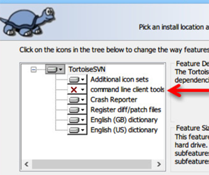  

Question 13  
如何排除一个配置不打表到客户端配置中?  
`Project1\Client\excel\ts_fengzhi39_D1\exclude.json`  

Question 14  
如何缩放spine特效?  
改变UI中的sprite的ScaleX和ScaleY  

Question 15  
bin8 binGS目录删除即不会生成相关文件  

{r}Question 16{!r}  
```
压缩资源
qatools/compress_res.js  
resource下的uncompress.json设置不打包的资源  

all.bin ui.bin使用的是非缓存模式

字体生成
qatools/fontcompress.js
不用中文符号类似<！

```

# 调试链接

戳爆正式服  
`http://101.132.177.145:8001/Project1/Client/trunk/gameclient/bin/index.html?sy_url=https://server.game.wanhuir.com/&user=o5Ota5S-StXsxVOM66dl1P2ssCDY&debug=1&sdk_platform=0&platform=1&no_ta=1&proto_log=1&asset=http://101.132.177.145:8001/Project1/Client/trunk/resource/`

抖音  
`"url":"http://127.0.0.1:8001/Project1/Client/trunk/gameclient/bin/index.html?all_bin=https://winserver-game.wanhuir.com/Project1/Client/ts_fengzhi39_D1/resource/all.bin&sy_url=https://server.game.wanhuir.com/discount/&asset=http://127.0.0.1:8001/Project1/Client/trunk/resource/&sdk_platform=0&clienttype=1&platform=3&sider=1&skip=1&debug=1&user=dfc3402f9354b365aa6faf73eb480ac7&proto_log=1&no_ta=1&ver=v1_0_dy_2024_2_23",`

8U正式服  
`"url":"http://127.0.0.1:8001/project1/Client/fengzhi_45_douyin/rev_out/binb8/index.html?appid=8355&uid=11228668&ver=v1_0_dy_2024_2_2",`  

8U测试链接 discount_branch_2  
`http://101.132.177.145:8001/Project1/Client/discount_branch_2/rev_out/binb8/index.html?asset=http://101.132.177.145:8001/Project1/Client/discount_branch_2/rev_out/&sdk_platform=0&sy_url=https://dev-server.game.wanhuir.com/discount/`


* 0.1抖音正式服:  
`http://101.132.177.145:8001/Project1/Client/fengzhi_45_douyin/gameclient/bin/index.html?appid=tta085d6383fb5c61c02&sdk_platform=0&user=dfc3402f9354b365aa6faf73eb480ac7`

```js
var initConfig={
	"asset":"http://101.132.177.145:8001/Project1/Client/fengzhi_45_douyin/rev_out/",
	"platform":3,
	sy_url: "https://server.game.wanhuir.com/discount/",
	proto_log:1,
	clienttype:1
}
window["initConfig"] = initConfig;
```

* 8U_H5上传链接:  
`https://h5game.sg-discount.wanhuir.com/cbsg/8u/rev_out/binb8/index.html`  

* 公司版本的H5资源上传链接:  
`https://h5game.sg-discount.wanhuir.com/cbsg/shengye/rev_out/binGS/index.html`  

{r}抖音0.1折正式服{!r}    
`http://101.132.177.145:8001/Project1/Client/trunk/gameclient/bin/?all_bin=http://101.132.177.145:8001/Project1/Client/ts_fengzhi39_D1/resource/all.bin&sy_url=https://server.game.wanhuir.com/discount&platform=3&sdk_platform=0&clienttype=1&user=dfc3402f9354b365aa6faf73eb480ac7&debug=1`

{r}微信测试服{!r}  
`http://101.132.177.145:8001/Project1/Client/trunk/gameclient/bin/?debug=1&user=1&skip=1`

{r}微信灰度服{!r}  

		```
		var initConfig={
			"asset":"http://101.132.177.145:8001/Project1/Client/ts_fengzhi52/rev_out/",
			"platform":0,
			sy_url:"https://server.game.wanhuir.com/discount"
		}
		window["initConfig"] = initConfig;
		```
`http://101.132.177.145:8001/Project1/Client/ts_fengzhi52/gameclient/bin/?appid=wx8070b90126a0b503&sy_url=https://server.game.wanhuir.com&platform=1&sdk_platform=0&user=o5Ota5S-StXsxVOM66dl1P2ssCDY&all_bin=http://101.132.177.145:8001/Project1/Client/ts_fengzhi52/rev_out/all.bin`


{r}抖音0.1测试服{!r}    
`http://101.132.177.145:8001/Project1/Client/trunk/gameclient/bin/index.html?sy_url=https://dev-server.game.wanhuir.com/discount&clienttype=1&skip=1&no_ta=1&debug=1&all_bin=http://101.132.177.145:8001/Project1/Client/ts_fengzhi39_D1/resource/all.bin&sdk_platform=0&platform=3&user=012`  

# 美团
`https://game.meituan.com/#/`  

`https://game.meituan.com/#/docs`  

美团体验码  
`https://game.meituan.com/#/developer/app/version?appId=mgcahb3byqiu7esr&status=2`  

发布注意事项:  
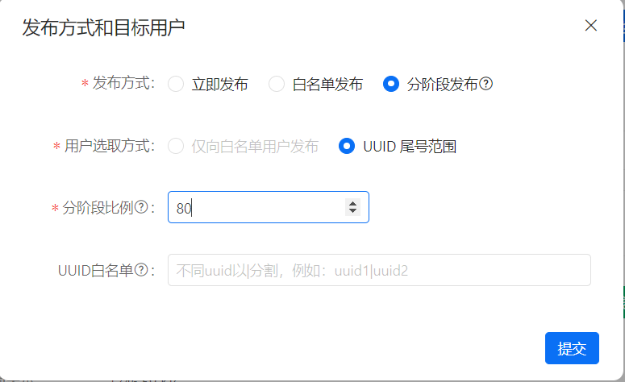

大象  
`https://ssosv.sankuai.com/sson/login?t=1709617575057&redirect_uri=https%3A%2F%2Fneixin.meituan.com%2Flogin%2Fsso%2Fcallback%3Foriginal-url%3D%252Flogin%252FloginRedirect%253Ff%253Dweb%2526ai%253D1%2526uuid%253Dae190320-dab3-11ee-9b80-9121ab8b78a7%2526redirect_uri%253Dhttps%25253A%25252F%25252Fx.sankuai.com%25252F%25253Fpath%25253D%2525252F&client_id=xm-xai&locale=zh`

`Project1\Client\tools\empty`  

---
 新人礼包 

	newplayer.jpg
	t_Pack_FirstPay_Equip 8~10 皮肤礼包
	t_Pack_FirstPay_Skin 1~7 新人礼包  

---
# API  
调用方式  
`http://101.132.177.145:8005/api?func=getinfo`

修改当前分支  
`/api?func=setfenzhinow&v=ts_fengzhi51_douyin`  

获取当前分支  
`/api?func=getfengzhinow`  

获取信息  
`/api?func=getinfo`  

svn清理  
`api?func=cleanup`  

执行jenkins任务  
`/api?func=runjk&v=test`  

打包生成setfenzhinow中的当前的分支  
`/api?func=runjk&v=fengzhi_now`  

发布配置  
`http://101.132.177.145:8080/job/fengzhi_now/`

打包ui资源  
`http://101.132.177.145:8005/api?func=export_ui&branch_name=ts_fengzhi51_douyin`  

编译  
`http://101.132.177.145:8005/api?func=simple&branch_name=ts_fengzhi51_douyin`  

退出服务器  
`/api?func=exit`  

```
set branch_name=ts_fengzhi39_D1
cd C:\Project1\Client\excel
set path=C:\Program Files\TortoiseSVN\bin\
svn up --username jiangjieqi --password 123456

cd C:\Project1\Client\%branch_name%\gameclient\cmd
call online_excel.bat no_showinfo
```

`ts_fengzhi50_discount`

# 数数字段
```
version_num:string;
client_platform:number;
clientsys:string;	当前的机型
new_player_guide_{id} 新手引导
```

# 更新流程
<markdownMd>project1/Client/doc/更新流程.md</markdownMd>

# 打表备注说明  

创建all_config.bat  

cmd/input_branch.bat 构建分支  

`D:\Project1\Client\excelbuild`  
```json
{
	"cur":"ts_fengzhi52",
	"discount":"ts_fengzhi51_douyin"
}
```

cur:当前的微信配置  
discount:当前的0.1配置  

执行Project1/cmd/discount.bat  

注意:配置表变化的时候 清理格式 设置格式为文本  

# 测试服打表  

* 执行`D:\Project1\cmd\ssh_entry`  

{file}project1/cmd/ssh_entry.bat{!file}  

# 项目结构
{file}Project1/Client/tools/qatools/compile.js@项目结构{!file}
# 代码

	<script type="text/javascript" src="libs/min/laya.debugtool.min.js"></script>

```ts
class ViewBase{
    protected onShow(){
        super.onShow();
		//界面缩放特效播放完毕 可取界面组件的相关信息
  	}
}
```

```c
static void pushMd2Frame(void* ptr,void* _md2Parse,int gap){
    int i;
    struct MD2_Frame* frame;
    
    for(i = 0;i </* _md2Parse->numFrames*/md2parse_totalFrames(_md2Parse);i++)
    {
        frame = md2parse_getFrame(_md2Parse,i);//&(_md2Parse->pframe[i]);
        //md2parse_getFrameVertex(frame,&vertexData.vertex,&vertexData.vertLen);
        //struct VertexData vertexData;
        //objVBO_pushNode(ptr,vertexData.vertex,vertexData.vertLen * gap);
        objVBO_pushByVerts(ptr,frame->vertices,frame->vertCount * gap);
    }
}
```

* 自定义页签参考
{file}Project1/Client/trunk/gameclient/src/game/view/handle/tabview/TabLargeWarrior.ts{!file}


输出日志
```ts
LogSys.Log("===>start"+Laya.timer.currTimer+":" + path + "," + volume);
```
launch.json
```json
{
	//魔兽
	"url":"http://127.0.0.1:8001/Project1/Client/trunk/gameclient/bin/index.html?skip=1&platform=5&sdk_platform=0&sy_url=https://dev-server.game.wanhuir.com/discount/&asset=http://127.0.0.1:8001/Project1/Client/trunk/resource_war/&debug=1&user=1&ver=dev&clientype=1",

	//戳爆抖音0.1
	"url":"http://127.0.0.1:8001/Project1/Client/trunk/gameclient/bin/index.html?skip=1&platform=3&sdk_platform=0&sy_url=https://dev-server.game.wanhuir.com/discount/&asset=http://127.0.0.1:8001/Project1/Client/trunk/resource/&debug=1&user=1&ver=dev&clientype=1",

}
```
IGameAdapter魔兽和戳爆三国的适配接口

{file}Project1/Client/trunk/gameclient/src/game/adapter/IGameAdapter.ts{!file}

<!-- D:\Project1\Client\trunk\gameclient\src\game\view\handle\tabview -->

# todolist

War3相关

1 `D:\Project1\Client\trunk\resource_war\o\equip文件中的文件替换成D:\Project1\Client\trunk\resource_war\o\equip\hero_104.png的文件`  

2.`t_Gym_NPC_Image的字段f_SingleAnimeTime值修改了`  

3.战斗中的翅膀和坐骑  

4.冒险中的角色方向  

5.颜色的品质t_EquipmentQuality  

~~6.副将300界面~~  

~~t_Chief_Skin_List 副将形象id~~  


tower

1 ~~地形重构成编辑器map_0.json模式~~  
2 哪吒的特效方向特殊处理...  
3 HeroAvatarView由策略解耦掉  


魔兽抖音测试服配置
```json
//正式服
var initConfig = {
	ttappid: "76251604390e45f0a26ffe3b6a6dbbb9",
	//asset:"https://cdnserver-game.wanhuir.com/cbsg/ts_fengzhi55/rev_out/",
	asset:"https://winserver-game.wanhuir.com/Project1/Client/trunk/resource_war/",
	all_bin:"http://winserver.game.wanhuir.com/Project1/Client/war3/resource/all.bin",
	platform: 3,
	// sy_url: "https://server.game.wanhuir.com/discount/",
	sy_url:"https://dev-server.game.wanhuir.com/war3/",
	ver:"dev",
	channel_key: "三国游侠_抖音",
	clienttype: 1,
	adunitid: "2fs5pyna7pl3inmpub",
	skin_type:1,
	debug:1
}
window["initConfig"] = initConfig;
```

# WAR3配置和资源说明

相关脚本(生成预览资源配置)  

1 `..\Project1\Client\towertrunk\resource\o\spine\skill\12下的文件资源放到\project4_war3\art\spineshow`  
2 `..\project4_war3\cmd\buildfile.bat`  
3 {h}http://127.0.0.1:8001/project4_war3/art/web/bin/{!h}  

jenkins:  
{h}:8080/job{!h}


tasks:  
`生成war3本地配置`   
`exportUI_war(魔兽)` 


* 副将头像  
D:\Project1\Client\trunk\resource_war\o\chief--->副将头像icon  

* 坐骑-战旗   翅膀-光环 

* 战旗
```
D:\Project1\Client\trunk\resource_war\o\Image_Flag
```

* 光环ID
	```
	resource_war/o/Image_Halo/halo${ID}}/halo${ID}`;
	D:\Project1\Client\trunk\resource_war\o\Image_Halo
	```

* war3主干配置  
`D:\Project1\Client\excel\war3`  

* 子弹(弹道)路径  
	`resource_war/o/bullet/${id}.png`  
	`Project1/Client/trunk/resource_war/o/bullet`  

```ts
export class t_Enemy_Image_dat{
	/*攻击弹道资源*/
	public f_BulletPic:number;
}

export class t_Custom_Costumes_dat{
	/*攻击弹道资源*/
	public f_BulletPic:number;
}

export class t_Chief_List_dat{
	/*攻击弹道资源*/
	public f_BulletPic:number;
}
```

* 弹道基于角色原点的偏移  
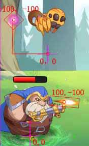  

{file}Project1/Client/trunk/gameclient/src/game/view/handle/avatar/ShootAvatar.ts@onCompleteHandler{!file}  


* 宠物的弹道取的技能配置:  
如宠物触发了技能983之后`t_Skill_EffectT`字段`f_ExEffect`这时候代表远程弹道id    

* 冒险的头像,战魂的头像  

	`t_Adventure_Level字段 f_headIcon`  
	`资源路径 resource_war/o/equip/hero_${id}.png`  
	`Project1\Client\trunk\resource_war\o\equip\*.png`  

* 副将形象  

```ts
export class t_Chief_Skin_List_dat{
	public f_id:number;
	/*皮肤id*/
	public f_skinid:number;
}
```

`f_skinid对应 resource_war/o/Image_Character/h${f_skinid}/h${f_skinid}`

* 标题配置表  
`t_ViewTitle`  
```
美术在所在的UI中设置一个label名字为title
字段f_viewType对应的类型检测文件为D:\Project1\Client\trunk\gameclient\src\game\common\defines  
或者在debug=1的模式下面看左上角的数字
```

* 分页页签字段
	t_Func表中相关字段:
	标题用的图片		页签内的功能
	`f_tab_title_img	t_tab_func`

* 装备

	`D:\Project1\Client\trunk\resource\o\item`

* 物品icon

	`D:\Project1\Client\trunk\resource_war\o\icon`


* 武馆名将录
```ts
`o/gym/${f_iconid}.png`;
```

* `t_War3_Config`  
	`j_journey_is_open` 1代表征途常驻  

* 战斗数字动画特效位置  
	`Project1\Client\trunk\resource_war\o\spine\effect2`  

* 一般,史诗...  
	`t_EquipmentQuality.xlsx`

* t_MainIcon  
	`只填写 f_pos 和 f_funid 字段的时候就不会在任何动态列表中加进去,只能静态程序中关联`  
	`f_id, f_icon, f_funid, 备注`只有这些字段,这个icon不会在列表里  

* `t_Txt_Config`  
	`主题文本替换表`  

# 生成字体  

* `D:\Project1\Client\trunk\gameclient\cmd\fontcompress.bat`  
* 生成好直接提交`D:\Project1\Client\trunk\resource_war\remote\font`下的字体文件  

	task模式:
	
		+------------+    +-----------+
		|fontcompress|--->|commit_font|
		+------------+    +-----------+

* `t_MainIcon的f_funarr子菜单配置`  
	


* 战魂  
	* `t_Spirit_Attribute_Fixed字段f_SpiritIconID配置战魂的ICON`    

* `t_Gym_NPC_List_dat`
   * 武馆配置描述f_info  

* `t_Tasks_Type`任务描述相关  
	`获得{1}个鸡腿`  

* 音效文件夹  
`..\Project1\Client\trunk\resource_war\o\audio`  
 
* t_Item
	* `f_sub_type:16 用户客户端特效的`
	* `f_p4指向t_Shop的f_id`

* `t_Gym_Mission_List`
	* `武馆的任务配置`
	* `o/gym/${f_iconid}.png`
	* `f_iconid是byte类型` 


* 战魂计算战斗力
	
	{file}Project1/Client/trunk/gameclient/src/game/view/handle/main/proxy/t_Power_level.ts@calculatePlus{!file}  

* Boss资源配置  
	`t_Alliance_Boss_Attribute`字段`f_Res`对应`\Project1\Client\trunk\resource_war\o\spine\monster01`

* `t_Pet_Quality_dat`  
	`一键合成`
```ts
	/*是否可以跳过动画*/
 	f_isSkipAnim:number;
```

* `t_EquipmentQuality`  
	`f_openvaluerd`主界面挂机随机的怪物血量百分比  

* BOSS头像  
	`o/boss/${this.cfg.f_BossID}.png`

* 引导  
	`9-func19-btnCon` 主界面功能funcid=19的按钮中的btnCon  
	`9-menu-1` 小菜单中的funcid=1  
	`9-mainBtn-btnCon` 主界面冒险按钮

	配置`t_Tasks_Guide`引导偏移位置字段偏移`f_XY` `100;10`  

* 坐骑洗髓

```ts
/*坐骑洗髓属性*/
export class stMountRefinement{
	/*属性类型id 读取t_EffectValue.xlsx和t_EquipmentValue.xlsx*/
	public id:number;

	/*属性值t_EquipmentValue.xlsx*/
	public value:number;

	/*属性类型,没有则为0,对应t_Mount_Refinement_Attributerange.xlsx*/
	public quality:number;

	/*属性值额外加成(万分比)*/
	public valueExtra:number;
}
```

* 战斗站位  
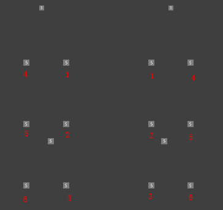   

* `t_Platform`

	`f_ad_close:1关闭广告功能`  
	`f_soft:软著`  

* 隐私协议/用户协议  
	`o/yhxy/default`  
	`o/yhxy/quick`  

	`t_Platform字段`  

		+---------------+
		| f_watch_agree |
		+---------------+

	改字段1的时候首先获取本用户是否有游戏角色,无游戏角色,就强制去选掉隐私协议勾选项  


* 适龄提示  
	`t_Platform字段`  

		+-----+        +------------------------+
		|f_age|------->|o/yhxy/quick/age16.txt  |
		+-----+        +------------------------+
           |
           v
		+--------------------------+
		|remote/loginnew1/age16.png|
		+--------------------------+
   
   如果是12岁将16替换成12即可  


* 设置血条偏移  
	`t_Image_List字段f_FlyImage`

* 宠物使用的动作索引号(0开始)  
```
Move = 2,
Stand = 12,//战斗待机

/**射击蓄力 */
ShootStart = 29,
/**射击收手 */
ShootRun = 30,

HandBookStand = 31,
HandBookShow1 = 32,
HandBookShow2 = 33,
```

# 上排右侧按钮控制
`t_MainIcon表`
字段`f_Uiexpand`无值  
按照`f_pos`有值,升序排序  
`t_System_RefreshTime表中的70`  
参考{h}:8001/github/jjqmdlib/entry/doc.html?file=Project1\Client\doc\read.md&l=ESystemRefreshTime{!h}  

# 道具获得途径

* `t_Item_AccessUI`
	* 道具获得途径
	* `限时礼包关联item的f_p3对应t_Pack_Controller中得f_packid和f_p4`


# quick
接入文档  

{h}https://www.quicksdk.com/doc-762.html{!h}  

{file}Project1/Client/trunk/gameclient/bin/quick.js{!file}

猎人玩正式服的CDN    
`https://lr-cdn.youjiayouxi.cn/quick/`

`/bin/js`  
`/rev_out`  

代码  
`https://lr-cdn.youjiayouxi.cn/quick/bin/js/bundle.js`  

配置  
`https://lr-cdn.youjiayouxi.cn/quick/rev_out/all.bin`


	3733专服参数  1
	btgo专服需求  2
	爱趣专服参数  3
	混服需求      4
	咪噜专服需求  5
	闪趣专服需求  6
	小7专服需求   7
	一元专服需求  8  


链接配置文档  
{h}:8001/github/jjqmdlib/entry/doc.html?file=Project1/Client/doc/quick.md{!h}  

web正式  
{h}https://cdnserver-game.wanhuir.com/cbsg/quick/bin/index.html?config=quick&ProductKey=78527444&ProductCode=21235891789817030328541177859562&dummyquick=1{!h}  

未用CDN的正式服链  
{h}:8001/Project1/Client/ts_fengzhi57_seven/gameclient/bin/index.html?config=quick_debug1&dummyquick=1&user=47662827_lkUPNT{!h}  

正式服  
{h}:8001/Project1/Client/ts_fengzhi57_seven/gameclient/bin/index.html?config=reals_test&dummyquick=1&user=malt1720577168iVe5MR&ProductKey=33064413{!h}  

dev测试服  
{h}:8001/Project1/Client/ts_fengzhi57_seven/gameclient/bin/index.html?config=q_debug&dummyquick=1&user=testuser1&ver=dev&debug=1{!h}  

`Project1\apk_packager\猎人王01折-一元专服_一元_2.5_202407111746_winserver包`  
```js
var initConfig = {
	clienttype:1,
	asset:"https://winserver-game.wanhuir.com/Project1/Client/ts_fengzhi57_seven/rev_out/",
	discount_all_bin:"https://winserver-game.wanhuir.com/Project1/Client/ts_fengzhi57_seven/rev_out/all.bin",
	ProductCode:"21235891789817030328541177859562",
	ProductKey:"78527444",
    platform:8,
	sy_url:"https://lr-api.youjiayouxi.cn/discount",
	pay:"https://lr-api.youjiayouxi.cn/discount/pay/callback/quick"
}
window["initConfig"] = initConfig;
```


```
Access to XMLHttpRequest at 'https://qkh5api.quickapi.net/webGame/initApi?config=quick&ProductKey=78527444&ProductCode=21235891789817030328541177859562&app_id=DYUG6672A3BAEA456&user_id=12438377&user_name=dy81439992-1&extra=&email=%2A&avatar=&device_no=&sign=4259cc22f380d6daa3f84f9165ec34b0' from origin 'https://lr-cdn.youjiayouxi.cn' has been blocked by CORS policy: No 'Access-Control-Allow-Origin' header is present on the requested resource.
```
`https://qkh5api.quickapi.net`加跨域访问权限  

# onlineexcel
{file}Project1/Client/tools/qatools/post_hook.js@DESC{!file}  

{file}Project1/Client/tools/qatools/json2bAll.js@BUILD_FLOW{!file}  

{file}Project1/Client/tools/qatools/json2bAll.js@DATA_STRUCT{!file}  

{file}Project1/Client/tools/qatools/ui_export.js@EXPORT_UI{!file}  

# 清理file1.log
`8005/api?func=f_clear_file&file=Project1/cmd/file1.log`

`Project1/cmd/file1.log`


```
本体配置 all.bin
0.1配置 all2.bin
```

# war3折心动
测试地址  
{h}https://docater1.cn/Wap/App/game_sy/?channel=83ba86ff6e5f77214870e28e9890d77f{!h}  

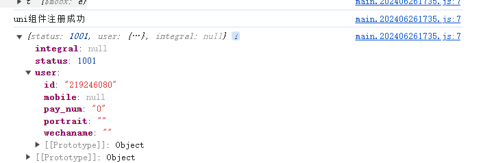  

{h}https://cdnserver-game.wanhuir.com/cbsg/war3/rev_out/bin/index.html?config=zxdconfig&token=be0a7ab4cf0e6cb671fb36a1e4bce7fb&user=o5Ota5Writxsg29fvyg0CLFKsf0E{!h}  

灰度服  
{h}:8001/Project1/Client/ts_fengzhi58_war3/rev_out/bin/index.html?config=zxdconfig_debug&token=be0a7ab4cf0e6cb671fb36a1e4bce7fb&user=oHAHm0qFJiNWPSdqWVeXLvczTvSQ{!h}  

代码  
`https://cdnserver-game.wanhuir.com/cbsg/war3/rev_out/bin/js/bundle.js`  

配置  
`https://cdnserver-game.wanhuir.com/cbsg/war3/rev_out/all.bin`  

壳包提审  
{h}https://winserver-game.wanhuir.com/Project1/Client/ts_fengzhi58_war3/gameclient/bin/index.html?config=zxdconfigts&token=be0a7ab4cf0e6cb671fb36a1e4bce7fb&username=o5Ota5Writxsg29fvyg0CLFKsf0E{!h}

# 背包塔防

	塔防地图位置说明
	+-----------------+
	|02 12 22 32 42 52|
	|01 11 21 31 41 51|
	|00 10 20 30 40 50|
	+-----------------+

# 背包塔防taptap

`towertrunk\resource\o\yhxy\default`  
隐私协议{h}https://cdnserver-game.wanhuir.com/cbsg/taptap/yx/privacy.html{!h}  
用户协议{h}https://cdnserver-game.wanhuir.com/cbsg/taptap/yx/user.html{!h}  

{r}Lucky Defense{!r}  

{h}:8001/Project1/Client/doc/mp4/塔防操作.mp4{!h}  
{h}:8001/Project1/Client/doc/mp4/塔防操作2.mp4{!h}  
{h}:8001/Project1/Client/doc/mp4/杀怪跳字.mp4{!h}  
{h}:8001/Project1/Client/doc/mp4/弹道.mp4{!h}  


jenkins打表  
{h}:8080/job/tower_config/{!h}  

协议  
{h}:8002/svn/Project1/Client/towertrunk/protos{!h}  

配置  
{h}:8002/svn/Project1/Client/towertrunk/resource/o/config/export{!h}  
{h}:8002/svn/Project1/Client/excel/towertrunk{!h}  

`sy_url:"https://dev-server.game.wanhuir.com/tower"`  

合成相关  
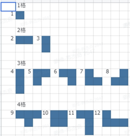  
  

{file}Project1/Client/towertrunk/gameclient/src/game/view/handle/compose/views/ComposeMain.ts@合成视图结构{!file}  


```
+---------------+
|ComposeDragGrid|------------->动物大组格子
+---------------+
```

{file}Project1\Client\towertrunk\gameclient\src\game\view\handle\compose\views\TopDragYellowView.ts@绘制虚线{!file}  

{file}Project1\Client\towertrunk\gameclient\src\game\view\handle\compose\FightUtils.ts@格内站位{!file}  

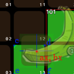  
检测ax,bx是否在cdef点围成的区域内  

动物形象  
`Project1\Client\towertrunk\resource\o\animal`  
4个点的区块位置
```
+-----+     +-----+
| 1,13|---->|22,13|
+-----+     +-----+
   ^           |
   |           |
   |           v
+-----+     +-----+
| 1,1 |<----|22,1 |
+-----+     +-----+
```
  

URL参数  
{file}Project1\Client\towertrunk\gameclient\src\game\view\handle\main\model\GmTest.ts@参数{!file}  

说明
```
1 BOSS头像地址 towertrunk\resource\o\monsterhead
2 英雄头像地址 towertrunk\resource\o\smallrole
2.1 神话英雄大头像 towertrunk\resource\o\bigherohead

3 序列帧avatar towertrunk\gameclient_ui\laya\assets\avatar

4 子弹单图 Project1\Client\towertrunk\resource\o\bullet

5 局内战斗spine角色 Project1\Client\towertrunk\resource\o\spine\fight
每个角色一个文件夹,用数字标号 用哪个数字根据策划定的id即可 如下


1\1.skel
1\1.png
1\1.atlas

6 局外图鉴spine角色 Project1\Client\towertrunk\resource\o\spine\outside
7 局内战斗子弹spine特效:\Project1\Client\towertrunk\resource\o\spine\bullet
8 局内战斗固定点位技能spine特效:\Project1\Client\towertrunk\resource\o\spine\skill

9 战斗胜利 Project1\Client\towertrunk\resource\o\spine\succeed

10 通用受击序列帧 Project1\Client\towertrunk\gameclient_ui\laya\assets\hit\0

11 通用眩晕序列帧 Project1\Client\towertrunk\gameclient_ui\laya\assets\hit\1

12 神话英雄展示头像

13 属性icon路径:resource\o\attr
```

微信配置
```js
var initConfig = {
	asset:"https://winserver-game.wanhuir.com/Project1/Client/towertrunk/resource/",
	platform:1,
	sy_url:"https://dev-server.game.wanhuir.com/tower",
	ver:"dev",
	debug:true,
  	Stat:1,
  	debugshow:true
}
window["initConfig"] = initConfig;
```

# 塔防坐标示意图

地图索引示意图  
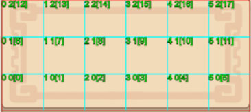  
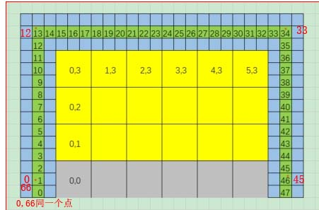  


{file}Project1/Client/towertrunk/gameclient/src/game/view/handle/compose/views/ComposeMain.ts@塔防坐标示意图{!file}  
  
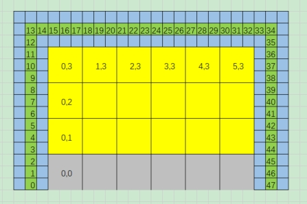  

# spine图集转Laya序列帧

注意事项:  

插槽名和附件名要一致  


spine输出的序列帧目录:`Project1\Client\towertrunk\resource\o\spineframe`  
最大化裁剪掉不使用的纹理部分

20.png		源纹理  
20.atlas	源图集信息  
20_anchor.png	拥有#ff00ff颜色锚点色块的纹理(注意源纹理规避使用改色值)  
{r}执行脚本run.bat生成{!r}  
Project1\Client\towertrunk\resource\o\spineframe\run.bat  


{r}预览效果{!r}  
{h}http://127.0.0.1:8001/Project1/Client/towertrunk/gameclient/bin/index.html?debug=1&user=spinetest&ver=dev&watchImg=2006{!h}  
`watchImg代表预览的序列帧文件`  


备注
```
1.可配置锚点偏移o\spineframe\offset.json  
2.提交完可以浏览器打开http://101.132.177.145:8005/api?func=f_svnup_project1&easy=1更新到线上  
```

{r}========================================= laya龙骨预览转spine ========================================={!r}  

预览工程目录:`D:\project1\htmltools\bin`  

`http://101.132.177.145:8001/github/Laya3dT1/myLaya22/bin/index.html?code=dragons.js&asset=http://101.132.177.145:8001/&sk=project1/temp/file/Footman.sk`

`http://127.0.0.1:8001/project1/htmltools/bin/index.html?code=dragons.js&asset=http://127.0.0.1:8001/&sk=project1/temp/file/Footman.sk`
```
启动资源服务器
nginx_start.bat - 快捷方式


待替换的资源目录
D:\Project1\temp 

文档
D:\Project1\Client\doc\read.md

资源预览网址
http://127.0.0.1:8001/project1/htmltools/bin/index.html?code=dragons.js&asset=http://127.0.0.1:8001/&sk=project1/temp/file/Footman.sk


资源预览路径，修改上面网址中的路径
project1/temp/file/Footman.sk


json文件转化：
spine高版本的.json文件放在
1.D:\Project1\spineview

2.双击convert.bat输出out目录

3.LayaAir 工具/spine动画转化
```


# 背包塔防towerGM
{file}project1/Client/doc/towerGM.ts{!file}  


# 上传配置
{h}:8001/Project1/Client/doc/mp4/cdn上传配置.mp4{!h}  
{h}:8001/Project1/Client/doc/mp4/lang.mp4{!h}  

# 配置表导出字段类型
{file}Project1/Client/tools/qatools/excelType.js@数据类型{!file}  

# 魔兽自走棋

抖音开发者平台:{h}https://developer.open-douyin.com/console?type=2{!h}  

`Project2`  

{h}:8001/github/jjqmdlib/entry/doc.html?file=Project2/read.md{!h}  
{r}vscode工程1 wx\wx630ac53162b9ed51{!r}  

{r}tasks:build_excel构建配置{!r}配置路径`excel\excel1 输出至\wx\res\zzq.bin` 

目录
```
wx\js
	--- Gs.js      		//wx\layaproject工程构建
	--- bundler.js 		//源工程可修改代码
	--- bytecfgload.js	//配置解析组件

wx\wx630ac53162b9ed51 --->抖音工程  
```
{r}tasks:编译{!r}构建layaproject及其js/bundle.js  

{r}vscode工程2 wx\layaproject{!r}    
ui工程`wx/ui_project/zzq01`  

输出:  
`wx\wx630ac53162b9ed51\js\release.js`  
`wx\res\...`  

抖音小游戏启动配置  
{h}Project2/wx/wx630ac53162b9ed51/config.js{!h}  


域名替换
```
https://cdnserver-game.wanhuir.com/cbsg/war3/rev_out/zxdconfig.js
```

公司  
`https://h5game-sg-discount.wanhuir.com/cbsg/8u/rev_out/binb8/initconfig.js`

比折玩  
`https://h5game-sg-discount.wanhuir.com/cbsg/8u/rev_out/binGS/initconfig.js`  

```
svn add *
svn commit -m . --force-log
```

# 塔防System_RefreshTime表

{file}Project1/Client/towertrunk/gameclient/src/game/view/handle/main/ctl/ESystemRefreshTime.ts{!file}  

# 塔防链接

{r}测试开发服{!r}  
{h}:8001/Project1/Client/towertrunk/gameclient/bin/index.html?config=initconfig&user=user02&ver=dev{!h}  

`appid=tower_kaifazhong`  

{r}当前分支灰度链接{!r}    
{h}:8001/Project1/Client/${branch_name}/gameclient/bin/index.html?user=oTAGY7aqTU_yB-kYCWCOXTWWijXA&config=initconfig_wx_gray&debugshow=1{!h}  

{r}线上灰度{!r}  
{h}https://cdnserver-game.wanhuir.com/cbsg/taptap/bin/index.html?config=initconfig_wx_gray&user=oTAGY7aqTU_yB-kYCWCOXTWWijXA{!h}  

微信正式服  
{h}:8001/Project1/Client/${branch_name}/gameclient/bin/index.html?user=1&debugshow=1&debug=0&config=initconfig_wx{!h}  


{h}:8001/Project1/Client/doc/h5 sdk 接入文档说明20241106.pdf{!h}  

测试apk包  
{h}https://fx-rs.wanhuir.com/app/android-pkg/tapTapundiscountedRnGameApp/production/oe/com.yongzhetianzhansy.exe-1000.1_f7133a2.apk{!h}  

微信登录测试链  
{h}https://docater1.cn/Wap/App/game_sy/?channel=86c762b3a05d0bd294d59b1f9b3d8cd4{!h}  

直播测试  
{h}:8001/Project1/Client/${branch_name}/gameclient/bin/index.html?user=a1234&config=initconfig&appid=tower_zhibo&sdk_platform=0&platform=1{!h}  

开发服  
{h}:8001/Project1/Client/${branch_name}/gameclient/bin/index.html?user=a1234&debug=1&config=taptap_test&sdk_platform=0&platform=10{!h}  

母链  
taptap {h}https://cdnserver-game.wanhuir.com/cbsg/taptap/bin/index.html?config=taptap{!h}  

查看线上配置    
{h}https://cdnserver-game.wanhuir.com/cbsg/taptap/bin/index.html?config=taptap&sdk_platform=0&platform=10{!h}  

qa  
{h}:8001/Project1/Client/towertrunk/gameclient/bin/index.html?user=user00003&ver=dev&debug=1&appid=tower_qa{!h}  
dev  
{h}:8001/Project1/Client/towertrunk/gameclient/bin/index.html?&user=user001&ver=dev&debugshow=1&config=initConfig{!h}  
taptap  
{h}https://winserver-game.wanhuir.com/Project1/Client/towertrunk/gameclient/bin/index.html?config=taptap{!h}  

本地服务器  
{h}http://127.0.0.1:8001/Project1/Client/towertrunk/gameclient/bin/index.html?&user=1&sy_url=http://127.0.0.1:8005&tcp=ws://127.0.0.1:8004&debug=1&disableSound=1{!h}

塔防灰度服  
{h}:8001/Project1/Client/${branch_name}/gameclient/bin/index.html?user=oTAGY7aqTU_yB-kYCWCOXTWWijXA&config=initconfig_wx_gray{!h}  

本地服务器  
{h}http://127.0.0.1:8001/Project1/Client/towertrunk/gameclient/bin/index.html?&user=a1&sy_url=http://127.0.0.1:8005&tcp=ws://127.0.0.1:8004{!h}
 


线上版本走开发服器  
{h}https://cdnserver-game.wanhuir.com/cbsg/taptap/bin/index.html?config=initconfig_wx_gray&user=user002&sy_url=https://dev-server-game.wanhuir.com/tower&appid=tower_kaifazhong&ver=dev{!h}

taptap事件  
{h}https://developer.taptap.cn/273897/app/724994/tapdb?path=%2Fmeta_event{!h}  

# bug截图记录  

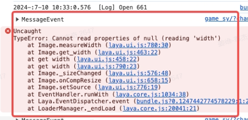  

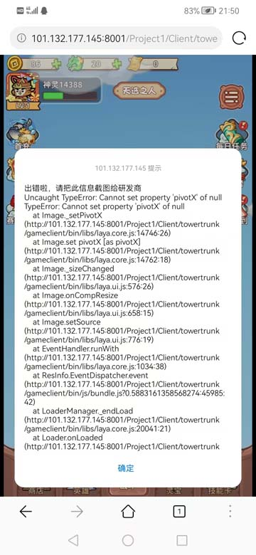

# 传表
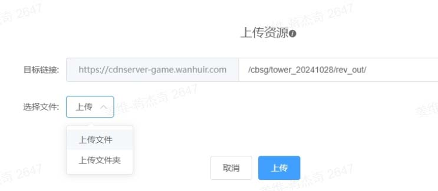  

`<script src="https://sq.test.docater1.cn/tpl/User/default/js/sdk.js"></script>`

# 引导参数说明
{file}Project1/Client/towertrunk/gameclient/src/game/view/handle/guide/CheckParamUtils.ts@params{!file}  

guide_action 引导事件  
{file}Project1/Client/towertrunk/gameclient/src/game/view/handle/guide/guideaction/ActionMgr.ts@params{!file}  

# 属性行为参数说明
{file}Project1/Client/towertrunk/gameclient/src/game/view/handle/compose/attraction/AttrAction.ts@params{!file} 

# 塔防initConfig参数
{file}project1/Client/towertrunk/gameclient/ext/init_config.d.ts{!file}  

{h}http://127.0.0.1:8001/github/jjqmdlib/entry/doc.html?file=Project1\Client\doc\read.md&basepath=http://127.0.0.1:8001/{!h}

# 塔防地编
{file}Project1/Client/map_editor/gameclient/src/game/view/mapeditor/MapEditorModel.ts@desc{!file}
{file}Project1/Client/map_editor/gameclient/src/game/view/mapeditor/MapFuncVo.ts@desc{!file}
